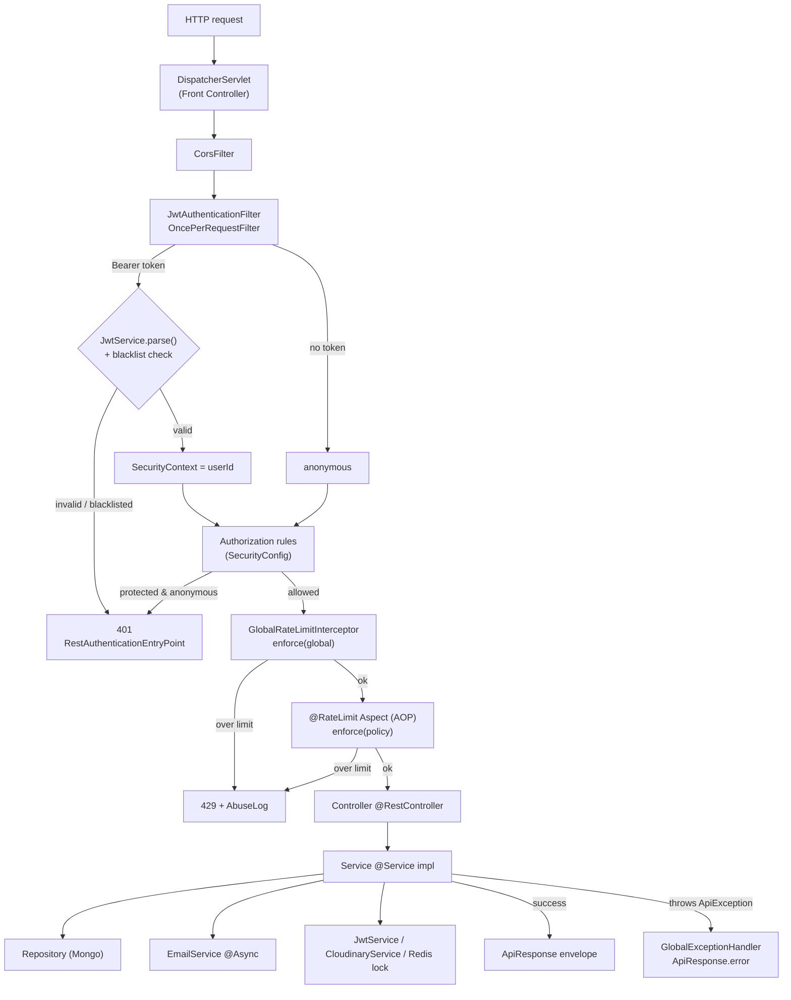
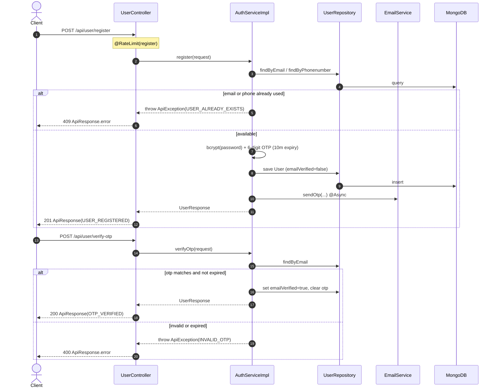
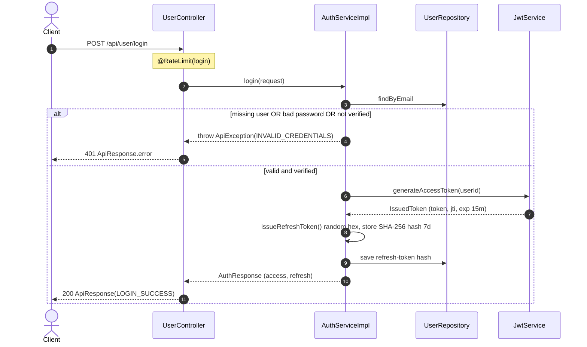
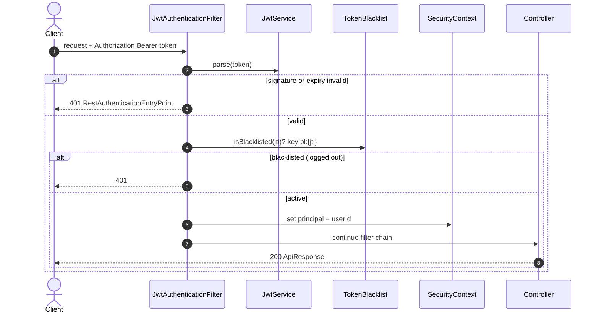
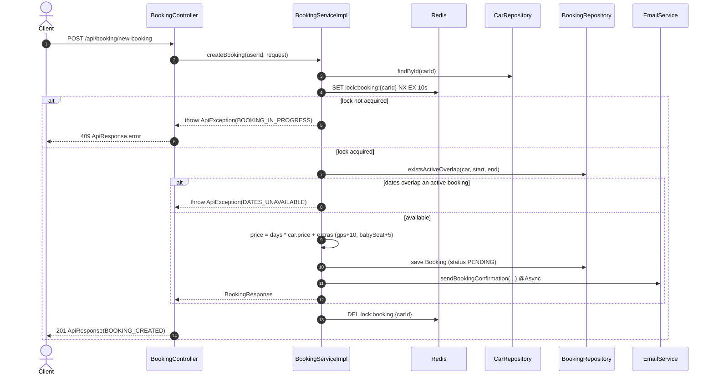
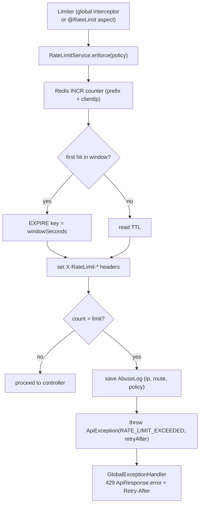
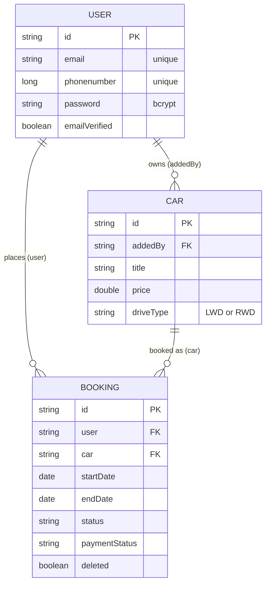

# CarHub — Architecture & Design Notes

This document explains how the codebase is organised and **why**. It is the
counterpart to the README's "how to run it." The guiding goal is the same one
the original service followed: strict separation of concerns, no magic
strings, and no hardcoded HTTP status codes or user-facing messages — but
expressed idiomatically for Spring Boot.

---

## 1. Package-by-feature

Code is grouped by **feature**, not by technical layer. Everything that changes
together lives together:

```
com.carhub
├── user/        ── User document, repository, AuthService(+Impl),
│   └── dto/        UserService(+Impl), mapper, controller, request/response DTOs
├── car/         ── Car document, repository, CarService(+Impl),
│   └── dto/        CloudinaryService, mapper, controller, DTOs, DriveType
├── booking/     ── Booking document, repository, BookingService(+Impl),
│   └── dto/        mapper, controller, DTOs, BookingStatus, PaymentStatus
├── email/       ── EmailService, EmailProvider strategy (Brevo/SMTP), model
├── ratelimit/   ── @RateLimit, RateLimitAspect, RateLimitService, interceptor
├── abuselog/    ── AbuseLog document + repository
├── common/      ── cross-cutting building blocks (see §3)
│   ├── exception/  ApiException, ErrorCode, GlobalExceptionHandler
│   ├── message/    MessageService, MessageKeys
│   ├── response/   ApiResponse, ResponseFactory
│   └── security/   JwtService, JwtAuthenticationFilter, TokenBlacklist, …
└── config/      ── SecurityConfig, MongoConfig, WebMvcConfig, OpenApiConfig
    └── properties/ typed @ConfigurationProperties beans
```

**Why:** a developer touching "bookings" opens one package and sees the whole
vertical — document, repository, service, controller, DTOs — instead of
hopping across `controllers/`, `services/`, `models/` trees. `common/` and
`config/` hold only what is genuinely shared.

---

## 2. Layered responsibilities within a feature

The same discipline as the   app (`controller → service → model`), enforced
by Spring stereotypes:

| Layer | Type | Responsibility |
|---|---|---|
| **Controller** | `@RestController` | HTTP only: bind/validate input, delegate to service, wrap the result via `ResponseFactory`. No business logic, no try/catch. |
| **Service** | interface + `@Service` impl | All business logic, DB access, orchestration. Throws `ApiException` carrying an `ErrorCode`. |
| **Repository** | `interface extends MongoRepository` | Data access only. Derived queries + `@Query` for overlap checks. |
| **Document** | `@Document` POJO | Mongo schema; Lombok `@Builder`/accessors; auditing timestamps. |
| **DTO** | `record` | Immutable request/response shapes; Bean Validation on requests. |
| **Mapper** | MapStruct / hand-written | Document ↔ DTO translation; keeps documents out of the API surface. |

Controllers never see a `Car` document and the web layer never leaks into
services — DTOs are the boundary in both directions.

---

## 3. Single source of truth: no hardcoded codes or messages

This was an explicit requirement carried over from the   project
(`statusCodes.js`, `messages.js`). Two collaborating pieces enforce it:

### `ErrorCode` (status + message key)
Each error is one enum constant bundling its **HTTP status** and a **message
key** — the only place either is declared:

```java
USER_ALREADY_EXISTS(HttpStatus.CONFLICT,        "error.user.already-exists"),
INVALID_CREDENTIALS (HttpStatus.UNAUTHORIZED,    "error.auth.invalid-credentials"),
RATE_LIMIT_EXCEEDED (HttpStatus.TOO_MANY_REQUESTS,"error.common.rate-limit");
```

Services throw `new ApiException(ErrorCode.USER_ALREADY_EXISTS)` — they never
name a status code or a string. Call sites can pass `args` for message
interpolation (e.g. a retry-after value).

### `messages.properties` + `MessageService`
Every user-facing string — error messages, success messages, and email
subjects — is resolved through Spring's `MessageSource` (i18n-ready):

- **Error keys** live on `ErrorCode`.
- **Success / email keys** are constants in `MessageKeys`, resolved by
  `ResponseFactory.ok(...)` / `created(...)`.

The result: changing wording or adding a locale is a properties-file edit; no
Java recompile of business logic, and grepping for a status code finds exactly
one declaration.

### `ApiResponse<T>` envelope
A single response shape across the whole API:

```json
{ "success": true, "message": "Login successful", "data": { ... } }
```

`@JsonInclude(NON_NULL)` keeps `data` out of error payloads.
`GlobalExceptionHandler` (a `@RestControllerAdvice`) is the **only** place
exceptions become responses, so no controller carries error-handling noise.

---

## 4. Design patterns used (and why)

| Pattern | Where | Why |
|---|---|---|
| **Dependency Injection (constructor)** | everywhere via Lombok `@RequiredArgsConstructor` | Immutable `final` collaborators, trivially testable, no field injection. |
| **DTO + Mapper** | every feature's `dto/` + `*Mapper` | Decouples the persistence model from the API contract; MapStruct generates the boilerplate at compile time. |
| **Service interface + impl** | `AuthService`/`AuthServiceImpl`, etc. | Dependency-inversion: controllers and cross-feature callers depend on the abstraction, enabling mocking and alternate impls. |
| **Repository** | Spring Data `*Repository` | Declarative data access; no DAO plumbing. |
| **Strategy** | `EmailProvider` → `BrevoEmailProvider` / `SmtpEmailProvider` | Swap email transport via `EMAIL_PROVIDER` env var (`@ConditionalOnProperty`) without touching `EmailService`. |
| **Template Method (templates)** | Thymeleaf `templates/email/*.html` | OTP/booking emails rendered from templates + a model object, not string concatenation. |
| **AOP + custom annotation** | `@RateLimit` + `RateLimitAspect` | Per-route limits are declarative on the controller method; the cross-cutting Redis logic lives in one aspect. A `HandlerInterceptor` enforces the global limit. |
| **Filter chain** | `JwtAuthenticationFilter (OncePerRequestFilter)` | Stateless token authentication runs once per request before the controller. |
| **Centralised advice** | `GlobalExceptionHandler` | One translation point from exceptions to `ApiResponse`. |
| **Typed configuration** | `@ConfigurationProperties` beans in `config/properties/` | `JwtProperties`, `CloudinaryProperties`, `RateLimitProperties`, … give type-safe, validated config instead of scattered `@Value`. |
| **Builder** | Lombok `@Builder` on documents/models | Readable construction of multi-field documents. |
| **Factory** | `ResponseFactory` | Single helper to assemble success/created envelopes with resolved messages. |

---

## 5. Security model

- **Stateless JWT.** HS256 via jjwt. Access token (`sub` = userId, `jti`, 15 min)
  + an **opaque refresh token** (random, stored only as a SHA-256 hash, 7 days,
  rotated on every refresh).
- **Logout** blacklists the access token's `jti` in Redis (`bl:{jti}`) for its
  remaining TTL and revokes the refresh token.
- `SecurityConfig` is stateless: public auth routes + public `GET /api/cars` +
  docs/health; everything else requires a valid bearer token.
  `@AuthenticationPrincipal String userId` exposes the caller's id to controllers.
- Passwords hashed with BCrypt. Login returns a single `INVALID_CREDENTIALS`
  for both unknown-user and wrong-password (anti-enumeration).

---

## 6. Reliability & concurrency

- **Booking overlap protection:** a Redis distributed lock
  (`lock:booking:{carId}`, `SET NX EX`) guards the create path, and the
  repository runs an active-overlap query before persisting — defence in depth
  against double-booking the same dates.
- **Rate limiting + abuse logging:** Redis `INCR`/`EXPIRE` counters; every
  violation is also written to the `abuse_logs` collection for auditing.
- **Async email:** sending is `@Async` and failures are logged rather than
  thrown — an email outage never fails a booking or registration. (The  
  version awaited inline; this is a deliberate improvement.)
- **Mongo auditing:** `@CreatedDate` / `@LastModifiedDate` populate timestamps
  automatically.

---

## 7. Sequence & flow diagrams

These render natively on GitHub. They show the runtime collaboration between the
components described above.

### 7.1 Request pipeline (every request)



### 7.2 Registration + OTP verification



### 7.3 Login + token issuance



### 7.4 Authenticated request (JWT filter)



### 7.5 Booking creation (distributed lock + overlap check)



### 7.6 Rate limiting + error translation



### 7.7 Domain data model

References are app-level id strings (no DB-enforced joins); the FK notation
below communicates intent.



---

## 8. Relationship to the   service

This is a behavioural port of `car_hub_backend`. Endpoints, validation rules,
OTP/booking flows, rate-limit policies, and the response envelope match the
original. Where Spring offers a cleaner idiom, it is used: typed configuration
properties over `process.env` lookups, an exception-advice over repeated
`sendError`, MapStruct over manual mapping, and async email over inline
`await`. The RabbitMQ / BullMQ queues that were commented out in the   app
are intentionally **not** ported.
