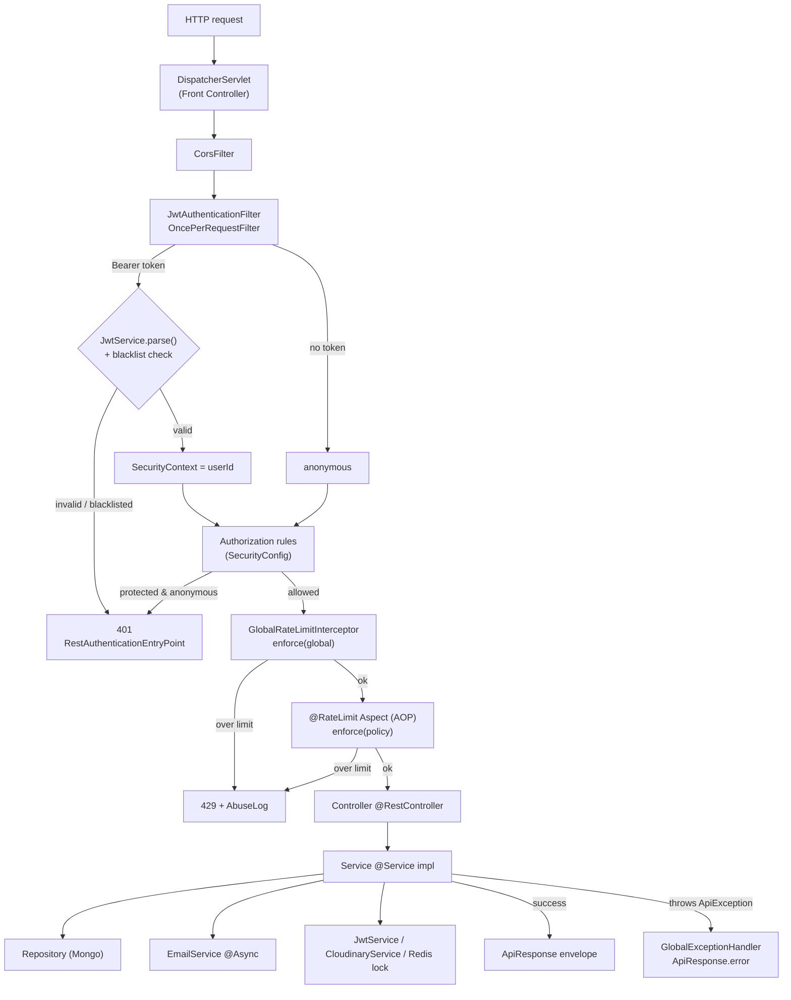
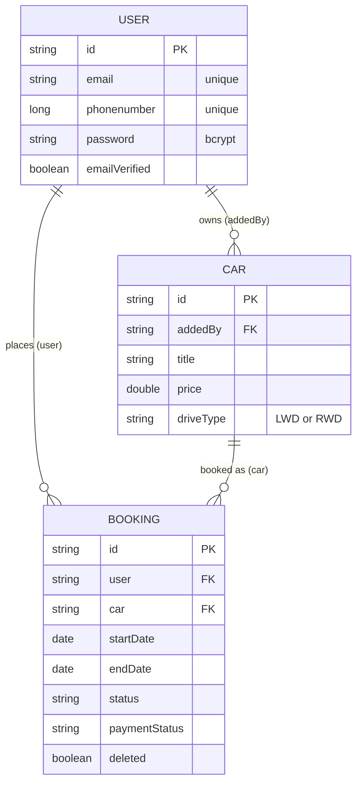

# CarHub — Spring Boot Backend

A car-rental backend: user registration with email OTP verification, JWT auth,
car listings with image upload and availability windows, and date-range
bookings with overlap protection. This is a production-grade Spring Boot port of
the original Node.js/Express service (`car_hub_backend`).

- **Java 21 (LTS)** · **Spring Boot 3.5.x** · **Maven**
- **MongoDB** (Spring Data MongoDB) · **Redis** (rate limiting, token
  blacklist, booking locks)
- **Spring Security + JWT** (stateless) · **Cloudinary** image hosting ·
  **Brevo/SMTP** email
- Centralised `ApiResponse<T>` envelope, `ErrorCode` enum, and
  `messages.properties` — no hardcoded status codes or message strings.

For the design rationale and patterns, see **[ARCHITECTURE.md](ARCHITECTURE.md)**.

---

## Prerequisites

| Tool | Version | Notes |
|---|---|---|
| JDK | 21 | `JAVA_HOME` must point at a 21 JDK |
| Maven | — | Use the bundled wrapper (`./mvnw`); no system Maven needed |
| MongoDB | running instance | local or Atlas |
| Redis | running instance | local or hosted |

This repo was developed against `openjdk@21` installed via Homebrew. If
`java -version` on your machine is not 21, prefix commands with the right
`JAVA_HOME`, e.g.:

```bash
JAVA_HOME=/usr/local/opt/openjdk@21 ./mvnw spring-boot:run
```

---

## Configuration

All configuration is environment-driven (see
[`application.yml`](src/main/resources/application.yml)). Copy the reference
file and fill it in:

```bash
cp .env.example .env
# edit .env, then export the values into your shell:
set -a; source .env; set +a
```

> Spring Boot reads from the OS environment, not from `.env` automatically — the
> `set -a; source .env; set +a` step (or your IDE's run-config env vars) is what
> makes them visible. Every variable has a safe local default except
> `JWT_SECRET` (production) and the Cloudinary keys (needed for image upload).

| Variable | Purpose |
|---|---|
| `PORT` | HTTP port (default `5001`) |
| `DB_URL` | MongoDB connection string |
| `MONGODB_DATABASE` | Database name (used only when `DB_URL` has none in its path, e.g. Atlas SRV) |
| `REDIS_URL` | Redis connection string |
| `JWT_SECRET` | HS256 signing secret (≥ 32 bytes) |
| `CLOUDINARY_CLOUD_NAME` / `CLOUDINARY_API_KEY` / `CLOUDINARY_API_SECRET` | Cloudinary image hosting |
| `EMAIL_PROVIDER` | `brevo` (HTTP API) or `smtp` |
| `EMAIL_SENDER_NAME` / `EMAIL_SENDER_ADDRESS` | From-identity on emails |
| `BREVO_API_KEY` | Brevo API key (when provider = `brevo`) |
| `EMAIL_HOST` / `EMAIL_PORT` / `EMAIL_USER` / `EMAIL_PASSWORD` | SMTP creds (when provider = `smtp`) |

---

## Running

```bash
# Dev server (hot restart via spring-boot-devtools is not enabled; use your IDE
# or re-run as needed)
./mvnw spring-boot:run

# Build a runnable fat jar
./mvnw -DskipTests package
java -jar target/carhub-0.0.1-SNAPSHOT.jar

# Compile only / run tests
./mvnw compile
./mvnw test
```

The server starts on `http://localhost:5001` by default.

### API docs

Swagger UI is served at:

- Swagger UI: `http://localhost:5001/swagger-ui.html`
- OpenAPI JSON: `http://localhost:5001/v3/api-docs`

Health check: `http://localhost:5001/actuator/health`

### Postman

Import [`postman/CarHub.postman_collection.json`](postman/CarHub.postman_collection.json)
— a self-contained collection (variables embedded) covering all 23 endpoints.
**Login** auto-saves `accessToken` / `refreshToken` / `userId`; protected
requests then send `Authorization: Bearer {{accessToken}}` automatically. When
the 15-min token expires, run **Refresh Token** to rotate it. `carId` /
`bookingId` are captured automatically by Add Car / Create Booking.

---

## API overview

All responses use the envelope `{ "success": boolean, "message": string,
"data": <T|null> }`. Protected routes require `Authorization: Bearer <accessToken>`.

### `POST /api/user` — auth & profile

| Method | Path | Auth | Purpose |
|---|---|---|---|
| POST | `/api/user/register` | public | Create account, email a 6-digit OTP |
| POST | `/api/user/verify-otp` | public | Verify OTP, mark email verified |
| POST | `/api/user/resend-otp` | public | Re-send OTP |
| POST | `/api/user/login` | public | Returns access + refresh tokens |
| POST | `/api/user/refresh-token` | public | Rotate refresh token, new access token |
| POST | `/api/user/forgot-password` | public | Email a reset OTP |
| POST | `/api/user/reset-password` | public | Reset password with OTP |
| POST | `/api/user/logout` | bearer | Blacklist access token, revoke refresh |
| GET | `/api/user/profile/me` | bearer | Current user profile |
| PATCH | `/api/user/profile/me` | bearer | Update profile |
| GET | `/api/user/profile/me/bookings` | bearer | Upcoming + past bookings |

### `/api/cars` — listings

| Method | Path | Auth | Purpose |
|---|---|---|---|
| GET | `/api/cars` | public | Paged listings; optional `startDate`/`endDate` availability filter |
| GET | `/api/cars/{id}` | public | Car detail + availability |
| POST | `/api/cars` | bearer | Add car (multipart, 3–10 images) |
| PUT | `/api/cars/{id}` | bearer | Update car (owner only) |
| DELETE | `/api/cars/{id}` | bearer | Remove car (owner only) |
| GET | `/api/cars/usercars` | bearer | Caller's own cars |

### `/api/booking` — bookings

| Method | Path | Auth | Purpose |
|---|---|---|---|
| POST | `/api/booking/new-booking` | bearer | Create booking (date-overlap protected) |
| GET | `/api/booking/my-bookings` | bearer | Caller's bookings (optional `status` filter) |
| GET | `/api/booking/{id}` | bearer | Booking detail |
| PATCH | `/api/booking/{id}/confirm` | bearer | Confirm booking |
| PATCH | `/api/booking/{id}/cancel` | bearer | Cancel booking |
| PATCH | `/api/booking/{id}/complete` | bearer | Complete booking |

### Rate limits

Enforced via Redis and surfaced through `X-RateLimit-*` / `Retry-After`
response headers. Violations are persisted to the `abuse_logs` collection.

| Scope | Limit | Window |
|---|---|---|
| Global (all requests) | 100 | 1 hour |
| `login` | 5 | 5 min |
| `register` | 5 | 10 min |
| `otp` (resend/forgot) | 3 | 5 min |

---

## Project layout

Package-by-feature under `com.carhub`:

```
user/        registration, OTP, login, JWT issuance, profile
car/         listings, image upload, availability
booking/     booking lifecycle, overlap & locking
email/       provider strategy (Brevo/SMTP) + Thymeleaf templates
ratelimit/   @RateLimit annotation, AOP aspect, Redis counter
abuselog/    persisted rate-limit violations
common/      ApiResponse envelope, ErrorCode, MessageService, JWT/security
config/      Spring config + typed @ConfigurationProperties
```

See **[ARCHITECTURE.md](ARCHITECTURE.md)** for layer responsibilities and the
design patterns used.

---

## Architecture at a glance

How a request flows through the app — filters, security, rate limiting, then the
controller → service → repository layers:



Domain data model (references are app-level id strings, not DB-enforced joins):



The full set of sequence diagrams (registration/OTP, login, JWT auth, booking
lock, rate limiting) lives in **[ARCHITECTURE.md §7](ARCHITECTURE.md#7-sequence--flow-diagrams)**.
